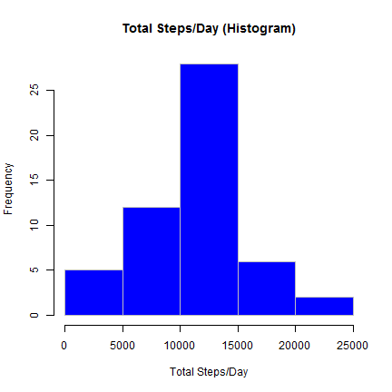
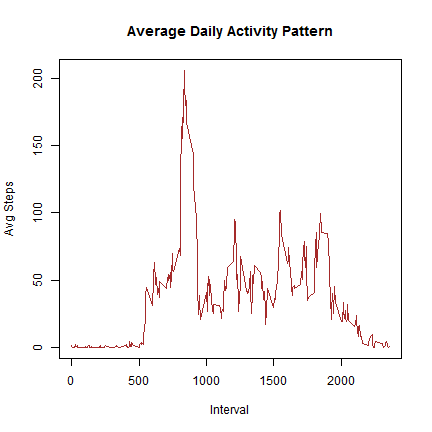
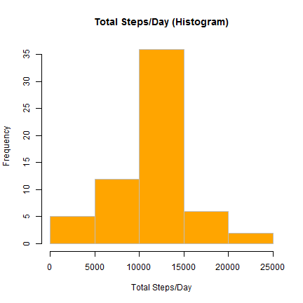
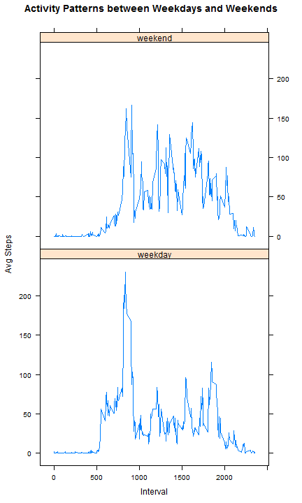

- - -
##Introduction
It is now possible to collect a large amount of data about personal movement using activity monitoring devices such as a [Fitbit](http://www.fitbit.com/), [Nike Fuelband](http://www.nike.com/us/en_us/c/nikeplus-fuelband), or [Jawbone Up](https://jawbone.com/up). These type of devices are part of the "quantified self" movement - a group of enthusiasts who take measurements about themselves regularly to improve their health, to find patterns in their behavior, or because they are tech geeks. But these data remain under-utilized both because the raw data are hard to obtain and there is a lack of statistical methods and software for processing and interpreting the data.

This assignment makes use of data from a personal activity monitoring device. This device collects data at 5 minute intervals through out the day. The data consists of two months of data from an anonymous individual collected during the months of October and November, 2012 and include the number of steps taken in 5 minute intervals each day.

##Data
The data for this assignment can be downloaded from the course web site:

- Dataset: [Activity monitoring data](https://d396qusza40orc.cloudfront.net/repdata%2Fdata%2Factivity.zip) [52K]
        
The variables included in this dataset are:

- **steps**: Number of steps taking in a 5-minute interval (missing values are coded as `NA`)
- **date**: The date on which the measurement was taken in YYYY-MM-DD format
- **interval**: Identifier for the 5-minute interval in which measurement was taken

The dataset is stored in a comma-separated-value (CSV) file and there are a total of 17,568 observations in this dataset.


## Loading and preprocessing the data
######1. Load the data (i.e. `read.csv()`)
Unzip the `activity.zip` and read the `activity.csv` into `activityData.1`

```r
activityData.1 <- read.csv(unz("activity.zip", "activity.csv"))
```

######2. Process/transform the data (if necessary) into a format suitable for your analysis
Transform the `date` column values from String to Date objects

```r
activityData.1$date <- as.Date(activityData.1$date)
```

## What is mean total number of steps taken per day?
######1. Make a histogram of the total number of steps taken each day

```r
totalStepsPerDay.1 <- aggregate(steps ~ date, data = activityData.1, FUN = sum, na.rm = TRUE)
hist(totalStepsPerDay.1$steps, 
     col="BLUE", 
     border="GRAY", 
     xlab="Total Steps/Day", 
     main="Total Steps/Day (Histogram)")
```

 

######2. Calculate and report the **mean** and **median** total number of steps taken per day

```r
meanOfTotalStepsPerDay.1 <- mean(totalStepsPerDay.1$steps)
message("Mean of Total Steps/Day: ", meanOfTotalStepsPerDay.1)
```

```
## Mean of Total Steps/Day: 10766.1886792453
```

```r
medianOfTotalStepsPerDay.1 <- median(totalStepsPerDay.1$steps)
message("Median of Total Steps/Day: ", medianOfTotalStepsPerDay.1)
```

```
## Median of Total Steps/Day: 10765
```

## What is the average daily activity pattern?
######1. Make a time series plot (i.e. `type = "l"`) of the 5-minute interval (x-axis) and the average number of steps taken, averaged across all days (y-axis)

```r
avgStepsPerInterval <- aggregate(steps ~ interval, data = activityData.1, FUN = mean, na.rm = TRUE)
        
## Construct a Line plot
plot(avgStepsPerInterval$interval, 
        avgStepsPerInterval$steps, 
        xlab = "Interval", 
        ylab = "Avg Steps",
        type = "l", 
        pch = 20, 
        col = "BROWN", 
        lwd = 1, 
        main = "Average Daily Activity Pattern")
```

 

######2. Which 5-minute interval, on average across all the days in the dataset, contains the maximum number of steps?

```r
intervalWithMaxAvgSteps <- avgStepsPerInterval[which.max(avgStepsPerInterval$steps), ]$interval
message("5-Minute Interval with Max Avg Steps: ", intervalWithMaxAvgSteps)
```

```
## 5-Minute Interval with Max Avg Steps: 835
```

## Imputing missing values
######1. Calculate and report the total number of missing values in the dataset (i.e. the total number of rows with `NA`s)

```r
totalStepValuesMissing <- sum(is.na(activityData.1$steps))
message("Total StepValues Missing: ", totalStepValuesMissing)
```

```
## Total StepValues Missing: 2304
```

######2. Devise a strategy for filling in all of the missing values in the dataset. The strategy does not need to be sophisticated.For example, you could use the mean/median for that day, or the mean for that 5-minute interval, etc.
######3. Create a new dataset that is equal to the original dataset but with the missing data filled in.
Strategy for filling in all of the missing values in the dataset is the mean for that 5-minute interval.

```r
activityData.2 <- activityData.1

for(i in 1:nrow(activityData.2)){
        if(is.na(activityData.2[i, ]$steps)){
                naStepInterval <- activityData.2[i, ]$interval                        
                intervalStep <- avgStepsPerInterval[avgStepsPerInterval$interval == naStepInterval, ]$steps
                activityData.2[i, ]$steps <- intervalStep
        }
}
```

######4.1 Make a histogram of the total number of steps taken each day and Calculate and report the **mean** and **median** total number of steps taken per day. 

```r
totalStepsPerDay.2 <- aggregate(steps ~ date, data = activityData.2, FUN = sum, na.rm = TRUE)
hist(totalStepsPerDay.2$steps,
     col="ORANGE", 
     border="GRAY", 
     xlab="Total Steps/Day", 
     main="Total Steps/Day (Histogram)")
```

 

```r
meanOfTotalStepsPerDay.2 <- mean(totalStepsPerDay.2$steps)
message("Mean of Total Steps/Day: ", meanOfTotalStepsPerDay.2)
```

```
## Mean of Total Steps/Day: 10766.1886792453
```

```r
medianOfTotalStepsPerDay.2 <- median(totalStepsPerDay.2$steps)
message("Median of Total Steps/Day: ", medianOfTotalStepsPerDay.2)
```

```
## Median of Total Steps/Day: 10766.1886792453
```

######4.2 Do these values differ from the estimates from the first part of the assignment? 

```r
diffInMeanOfTotalStepsPerDay <- meanOfTotalStepsPerDay.2 - meanOfTotalStepsPerDay.1
message("Difference In Mean of Total Steps/Day: ",diffInMeanOfTotalStepsPerDay)
```

```
## Difference In Mean of Total Steps/Day: 0
```

```r
diffInMedianOfTotalStepsPerDay <- medianOfTotalStepsPerDay.2 - medianOfTotalStepsPerDay.1
message("Difference In Median of Total Steps/Day: ",diffInMedianOfTotalStepsPerDay)
```

```
## Difference In Median of Total Steps/Day: 1.1886792452824
```

######4.3 What is the impact of imputing missing data on the estimates of the total daily number of steps?

```r
message("No major impact of imputing missing data on the estimates of the total daily number of steps")
```

```
## No major impact of imputing missing data on the estimates of the total daily number of steps
```

## Are there differences in activity patterns between weekdays and weekends?
######1. Create a new factor variable in the dataset with two levels - "weekday" and "weekend" indicating whether a given date is a weekday or weekend day.        

```r
tempDays <- weekdays(activityData.2$date)

for(i in 1:length(tempDays)){
        if(tempDays[i] == "Saturday" | tempDays[i] == "Sunday"){
                activityData.2$day[i] <- "weekend"
        } else {
                activityData.2$day[i] <- "weekday"
        }
}
```

######2. Make a panel plot containing a time series plot (i.e. `type = "l"`) of the 5-minute interval (x-axis) and the average number of steps taken, averaged across all weekday days or weekend days (y-axis). See the README file in the GitHub repository to see an example of what this plot should look like using simulated data.

```r
avgStepsPerWeek <- aggregate(steps ~ interval + day, data = activityData.2, FUN = mean, na.rm = TRUE)
        
library(lattice)

xyplot(steps ~ interval | factor(day), 
        data = avgStepsPerWeek,
        type = "l",
        main="Activity Patterns between Weekdays and Weekends", 
        ylab="Avg Steps", xlab="Interval")
```

 

Peek of activity can be seen on Weekday, but the activities over interval is more on Weekend.
